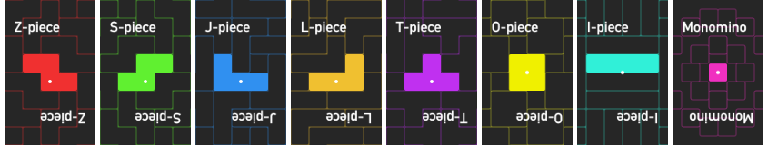
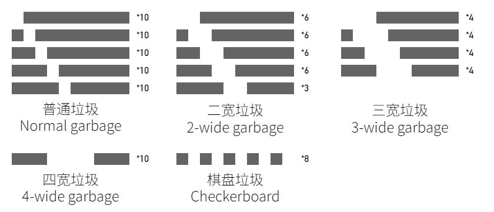

# Block-Killer 「方块杀」

本文在 CC-BY-SA-4.0 许可协议下提供。

您可以自由地：

共享 — 在任何媒介以任何形式、任何用途，甚至出于商业目的，复制、发行本作品。  
演绎 — 在任何用途下，甚至出于商业目的，修改、转换或以本作品为基础进行创作。

但须遵守下列条件：

署名 — 您必须给出**适当的署名**，提供指向本许可协议的链接，同时标明是否（对原始作品）作了修改。您可以用任何合理的方式来署名，但是不得以任何方式暗示许可人为您或您的使用背书。  
以相同方式共享 — 如果您重制、转换或者基于本作品进行创作，您必须基于**与原先许可协议相同的许可协议**发布您贡献的作品。  
不得有附加限制 — 不得利用**法律术语**或者**技术措施**限制其他人做许可协议允许的事情。

This article is provided under CC-BY-SA-4.0 license.

You are free to:

Share — copy and redistribute the material in any medium or format for any purpose, even commercially.  
Adapt — remix, transform, and build upon the material for any purpose, even commercially.  
The licensor cannot revoke these freedoms as long as you follow the license terms.  

Under the following terms:

Attribution — You must give appropriate credit , provide a link to the license, and indicate if changes were made . You may do so in any reasonable manner, but not in any way that suggests the licensor endorses you or your use.  
ShareAlike — If you remix, transform, or build upon the material, you must distribute your contributions under the same license as the original.  
No additional restrictions — You may not apply legal terms or technological measures that legally restrict others from doing anything the license permits.

**本文有中文、英文两个版本。英文版见** [**此**](#EngVer)。  
**For English version, see it** [**here**](#EngVer).

## 简介

这是一个以方块游戏为主要玩法的桌游，以现代方块对战为蓝本。

游戏的目标是组合你手上的方块与垃圾，攻击你的对手，令对手出局，并活到最后。

本游戏适合 3~6 人游玩。

## 游戏配件

* 方块牌 90 张

ZSJLTOI 7 种方块各 12 张，外加单元方块 6 张。

* 垃圾牌 111 张

见下图。

* 小方块若干

辅助操作用，包括由小方块（立方体）粘连拼接成的四连方块与若干单元块。

## 游戏规则

### 开始游戏

开始时，每位玩家分到 4 张方块牌与 4 张垃圾牌。

随机指定一名玩家，由这位玩家开始行动。

顺时针、逆时针方向轮流出牌均可，只需事先约定好。

### 抽牌、出牌

轮到某位玩家的回合时，该玩家需要抽取 1 张方块牌与 1 张垃圾牌，如果手上有 >=10 张垃圾牌且手上的方块牌数量 <5，可以改成抽取 2 张方块牌。

该玩家的回合结束后手上的方块牌数量必须 <6。也就是说，如果抽牌后手上有 6 张方块牌，则必须出牌。

此外的情况下玩家可以选择不出牌并跳过该回合。

#### 出牌方法（攻击）

玩家需遵循以下步骤出牌。

1. 指定要攻击的一名场上其他玩家。

2. 假想一个宽为 10 的方块场地，将想放置的垃圾牌按想要的顺序放入场地，垃圾牌允许翻转放置。垃圾与垃圾、垃圾与地板之间不得留有空列。一张垃圾牌只能使用一次。

3. 玩家可以将手上的方块牌以任意顺序，以下落式消除游戏的逻辑依次放入场地，一行填满时该行消除。方块只允许左右、向下移动，旋转，不能镜像。一张方块牌只能使用一次。

4. 当某个方块消行时，按照一定逻辑计算**攻击当量**。若手上有两行棋盘垃圾，则两行棋盘垃圾可以合并成一行实心垃圾，在放下第一块时消除。

5. 若确认方块摆放完毕，未被消除的垃圾行收回玩家手牌，所有使用掉的方块牌、被消除的垃圾牌进入弃牌堆。出牌过程中所有产生的攻击当量发送给指定的玩家。

#### 攻击当量计算

玩家的某一次消除分为两种，非旋转消除和旋转消除。旋转消除要求玩家消行的方块落定前最后一步是旋转且满足特定条件。

四行及以上的消除和旋转消除记作特殊消除。如果打出特殊消除且上一次消除也是特殊消除，攻击额外 +1。该次消行记作 Back-to-back 消除。

行数 | 非旋转消除攻击 | 旋转消除攻击
:---:|:---:|:---:
1 | 0 | 2
2 | 1 | 4
3 | 2 | 6
4 | 4 | -

可以选择削弱一些满足其它特定条件的旋转消除，使其产生的攻击当量与非旋转消除相等。该次消行记作 Mini 消除。

可能会出现普通消除行数 >4、旋转消除行数 >3 的情况，这种情况下，超出的行数不提供攻击，只提供与多出行数相等的抵挡值，防御时，抵挡值优先于攻击生效，与攻击当量 1:1 抵消，且不能视作攻击当量；攻击时抵挡值立刻失效。

\-

玩家也可以通过连击——连续的摆块均完成消行——增加攻击。连击数在消行开始时从 1 开始计数，方块未消行则清零。

连击奖励的攻击见下表。

连击数 | 攻击加成
:---:|:---:
1 | \+0 
2 | \+1 
3 | \+1 
4 | \+1 
5 | \+2 
6 | \+2 

#### 防御

防御方式与攻击方式相同，产生的**防御当量**与攻击当量 1:1 抵消。

若防御方抵消全部垃圾并有防御当量剩余，则剩余防御当量除以 2 向上取整后反打回攻击方，攻击方不得再次防御，需抽取对应数量的垃圾牌。

若防御方未能抵消全部攻击，则防御方要抽取剩余攻击当量数量的垃圾牌。

本轮出牌完毕后，进攻方顺位的玩家继续行动。

### 出局、胜利条件

任意时刻，若有玩家手上的垃圾牌数量 >12，该玩家出局。

最后一个未出局的玩家胜利。

## 可选特殊规则

### 毫不留情

基础攻击加强，多于 4 行的普通消行和多于 3 行的旋转消行，多出的行直接参与攻击计算，不提供防御值：

行数 | 非旋转消除攻击 | 旋转消除攻击
:---:|:---:|:---:
1 | 1 | 2
2 | 2 | 5
3 | 4 | 8
4 | 6 | 12
5 | 9 | 16

连击数 | 攻击加成
:---:|:---:
1 | \+0 
2 | \+1 
3 | \+2 
4 | \+2 
5 | \+3 
6 | \+3 

# English Ver. {#EngVer}

## Introduction

This is a board game with block-stacker games as the main gameplay, based on modern block-stacker battles.

The goal of the game is to combine the blocks and garbages in your hand, attack your opponent and eliminate them, and survive to the end.

This game is suitable for 3~6 people.

## Accessories

* Block card \*90

7 types of blocks, 12 each, with 6 extra minominoes.

* Garbage card \*111

See below.

* Several small minoes

For auxiliary operations, includes tetrominoes and several unit cells.

## Game rule

### Start

At the beginning, each player is dealt 4 block cards and 4 garbage cards.

A player is randomly assigned to start the action.

You can take turns to play cards in a clockwise or counterclockwise direction, just agree on it in advance.

### Draw and play cards

When it is a player's turn, the player needs to draw 1 block card and 1 garbage card. If there are >=10 garbage cards in hand and the number of block cards in hand is <5, you can change to draw 2 block cards.

The number of block cards in the hand must be <6 after the player's turn. In other words, if there are 6 block cards in hand after drawing cards, you must play at least 1 of your cards.

In other cases, the player can choose not to play a card and skip the turn.

#### How to play a card (How to attack)

Players need to follow the steps below to play cards.

1. Designate another player who are still in the game to attack.

2. Imagine a field with 10-cell width, and place the garbage cards you want to place in the field in the desired order. The garbage cards can be placed upside down. There must be no empty lines between garbage and garbage, or between garbage and the floor. A garbage card can only be used once.

3. Players can place the block cards in their hands in any order, according to the logic of a block-stacker game. When a line is filled, it will be cleared. The blocks are only allowed to move left and right and downward, and rotate, and cannot be mirrored. A block card can only be used once.

4. When a certain block caused a clearing, the **attack equivalent** is calculated according to a certain logic. If there are two lines of chessboard garbage in hand, the two lines of chessboard garbage can be merged into a row of solid garbage, which is cleared when the first piece is placed.

5. If confirmed that all planned blocks are placed, the uncleared garbage row will return to the player, and all used block cards and cleared garbage cards will go to the discard pile. All attack equivalents generated during the card-playing process are sent to the designated player.

#### Attack equivalent calculation

There are two types of clears: non-spin clear and spin clear. spin clear requires that the last step before clearing is to rotate and meet specific conditions.

Clears of four or more lines and spin clears are counted as special clears. If a special clear is done and the previous clear was also a special clear, the attack is increased by +1. The clear is counted as a Back-to-back clear.

Line(s) | Non-spin attack | Spin attack
:---:|:---:|:---:
1 | 0 | 2
2 | 1 | 4
3 | 2 | 6
4 | 4 | -

Some spin clears that meet other specific conditions can be weakened, so that the attack equivalent they produce is equal to that of non-spin clears. These clears is counted as a Mini clear.

There may be a situation when a non-spin clear with >4 lines or a spin clear with >3 lines. In this case, the extra lines will not provide attacks, but only add offset values ​​equal to the number of extra lines. When defending, the offset value takes precedence over the attack, offsets the attack equivalent at a 1:1 ratio, and cannot be considered as an attack equivalent; when attacking, the offset value immediately becomes invalid.

\-

Players can also increase their attack by performing combos - placing blocks to clear lines continuously. The combo count starts at 1 when a line is cleared, and resets to 0 if the blocks do not clear any line.

The attack bonus is shown in the table below.

Combo | Extra attack
:---:|:---:
1 | \+0 
2 | \+1 
3 | \+1 
4 | \+1 
5 | \+2 
6 | \+2 

#### Defense

The defense method is the same as the attack method, and the generated **defense equivalent** is offset by the attack equivalent at a ratio of 1:1.

If the defender offsets all the garbage and has a remaining defense equivalent, the remaining defense equivalent is divided by 2 and rounded up and then sent back to the attacker. The attacker cannot defend again and must draw the corresponding number of garbage cards.

If the defender fails to offset all attacks, the defender must draw the remaining number of garbage cards equivalent to the attack equivalent.

After the round of cards is played, the player after the attacker continues to act.

### Elimination and victory conditions

At any time, if a player has more than 12 garbage cards in his/her hand, he/she is out.

The last player who is not out wins.

## Optional Special Rules

### Show 'em No Mercy

Basic attack is amplified. A non-spin clear with >4 lines or a spin clear with >3 lines will directly participate in the attack calculation and will not provide offset value.

Line(s) | Non-spin attack | Spin attack
:---:|:---:|:---:
1 | 1 | 2
2 | 2 | 5
3 | 4 | 8
4 | 6 | 12
5 | 9 | 16

Combo | Extra attack
:---:|:---:
1 | \+0 
2 | \+1 
3 | \+2 
4 | \+2 
5 | \+3 
6 | \+3 